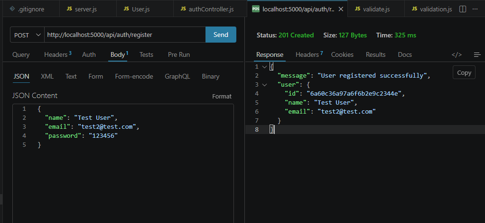
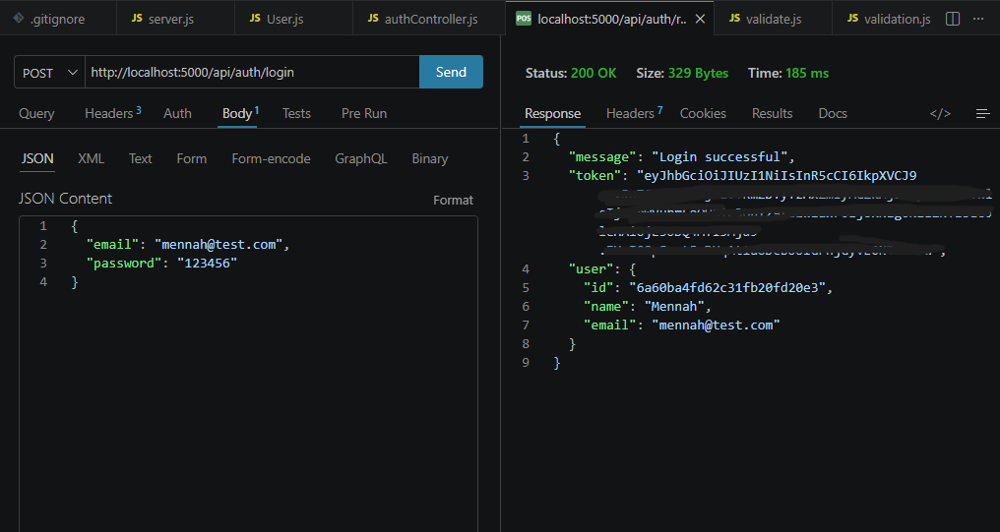
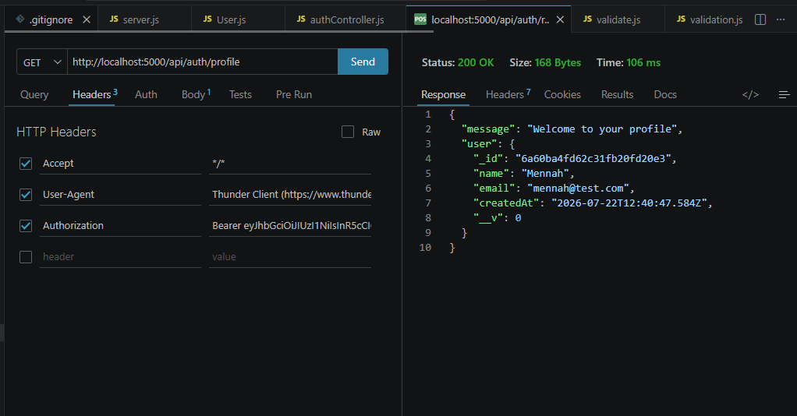

# 🔐 Secure Auth API

A secure REST API built with **Node.js**, **Express.js**, and **MongoDB** that provides user authentication using **JWT (JSON Web Token)** and password hashing with **bcrypt**.

## 🚀 Features

- User Registration
- User Login
- JWT Authentication
- Protected Profile Route
- Password Hashing with bcrypt
- Input Validation using express-validator
- MongoDB Atlas Integration
- Error Handling

---

## 🛠 Technologies Used

- Node.js
- Express.js
- MongoDB Atlas
- Mongoose
- JWT
- bcrypt
- express-validator
- dotenv
- Thunder Client

---

## 📂 Project Structure

```
Secure-Auth-API
│
├── config
├── controllers
├── middleware
├── models
├── routes
├── screenshots
├── server.js
├── package.json
└── README.md
```

---

## ⚙️ Installation

```bash
git clone https://github.com/EngMennah/Secure-Auth-API.git

cd Secure-Auth-API

npm install

npm run dev
```

---

## 🔑 API Endpoints

### Register

POST

```
/api/auth/register
```

### Login

POST

```
/api/auth/login
```

### Profile (Protected)

GET

```
/api/auth/profile
```

Requires JWT Token.

---

# 📸 API Screenshots

## Register



## Login



## Profile



---

## 👩‍💻 Author

**Mennah Elshaer**

GitHub:
https://github.com/EngMennah